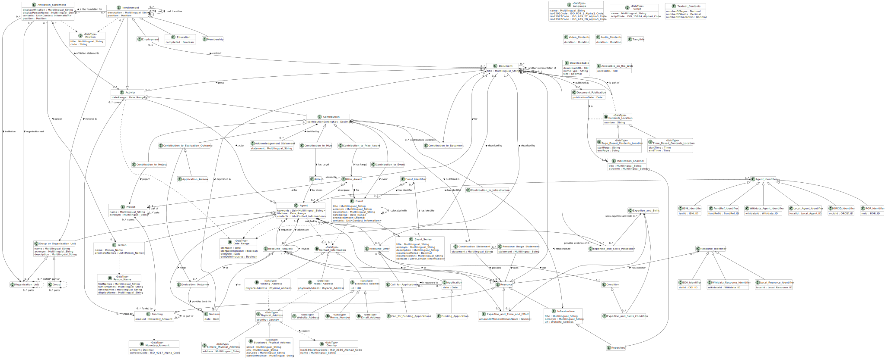

# CERIF Core

This is the Core of CERIF (=Common European Research Information Format), the result of 
the [CERIF Refactoring Pilot](https://www.eurocris.org/cerif-refactoring-project-introduction) project 
started in 2021 by [euroCRIS](https://www.eurocris.org/).

## Status

(2021-06-24) This is experimental. The scope, structure or any other aspect can change.

## Scope

The Core consists of the following entities:
* [Agent](./entities/Agent.md)
  * [Person](./entities/Person.md), [Organisation Unit](./entities/Organisation_Unit.md)
* Activity
* [Document](./entities/Document.md)
  * [Textual Document](./entities/Textual_Document.md)
* [Contributorship](./entities/Contributorship.md)
  * [Authorship](./entities/Authorship.md)
* [Affiliation Statement](./entities/Affiliation_Statement.md)
* [Contribution Statement](./entities/Contribution_Statement.md)
  * [Free Text Contribution Statement](./entities/Free_Text_Contribution_Statement.md)
* [Textual Document Accessibility Specification](./entities/Textual_Document_Accessibility_Specification.md)
* ...

And the following data types:
* [String](./datatypes/String.md)
* [Date](./datatypes/Date.md)
* [Boolean](./datatypes/Boolean.md)
* [Multilingual String](./datatypes/Multilingual_String.md)
* [ORCID iD Type](./datatypes/ORCID_iD.md)
* [ROR ID Type](./datatypes/ROR_ID.md)
* [URI](./datatypes/URI.md)
* [Person Name](./datatypes/Person_Name.md)
* [Postal Address](./datatypes/Postal_Address.md)
* [Language](./datatypes/Language.md), [Country](./datatypes/Country.md), [Script](./datatypes/Script.md)
* [Language Tag](./datatypes/Language_Tag.md)
* [Monetary Amount](./datatypes/Monetary_Amount.md)
* Codes for languages: [ISO 639-1 Alpha2 Code](./datatypes/ISO_639_1_Alpha2_Code.md), [ISO 639-2B Alpha3 Code](./datatypes/ISO_639_2B_Alpha3_Code.md), [ISO 639-2T Alpha3 Code](./datatypes/ISO_639_2T_Alpha3_Code.md)
* Codes for countries: [ISO 3166 Alpha2 Code](./datatypes/ISO_3166_Alpha2_Code.md)
* Codes for currencies: [ISO 4217 Alpha Code](./datatypes/ISO_4217_Alpha_Code.md)
* Codes for scripts: [ISO 15924 Alpha4 Code](./datatypes/ISO_15924_Alpha4_Code.md)
* ...

## Usage

The Core is seldom used on its own, you almost always need to add one or several additional modules.
Anyway, the Core includes the following examples:
* [Person](./examples/Person_Example1.md)
* ...

## Development

### Guidelines

Guidelines for the development of this and related projects are put in the [guidelines](./guidelines/) subdirectory.
Currently we specify how [entities](./guidelines/DESCRIBING_ENTITIES.md) 
and [datatypes](./guidelines/DESCRIBING_DATATYPES.md) should be described 
and how [diagrams](./guidelines/MAKING_DIAGRAMS.md) should be made.

### Tools

The [tools](./tools/) directory contains some useful tools:

* `./tools/list-references.sh [DIR]...` checks the integrity of the links between the entities and datatypes in this project together with projects specified by the list of directories one passes as parameters. It writes the targets of references together with their frequency. If a target is missing, the word `MISSING` is appended.

* `./tools/generate-diagrams.sh [DIR]...` generates the UML diagrams in this project together with projects specified by the list of directories one passes as parameters. You need Java 8 or later installed for this to run. We use [Plant UML](https://plantuml.com/) (in `./tools/plantuml.jar`) for this.

* `./tools/new-relationship-uuid.sh` generates a skeleton for describing relationship. The requirement is to have uuidgen installed to run the script. 

### Continuous Integration

We use a [Github action](./.github/workflows/plantuml.yml) to re-generate the SVG diagrams.
